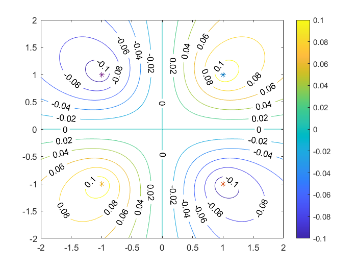

# 题目1
## 题目描述
结合Matlab环境的contour函数研究二元函数的等值线变化规律: 

平面上任取四个点 $x_1$ , $x_2$ , $x_3$ , $x_4$ ,研究含有参数的二元函数 $f(x)=\sum^{4}_ {i=1}{\theta_ {i}e^{-\gamma||x-x_i||^2}}$ 等值线的变化规律，其中 $\theta_i$ 为实数，$\gamma$ 为正实数
* 至少要考虑相邻两点对应的 $\theta_i$ 同号和异号的情况
* 各个参数变化等值线的变化规律
* 突出0等值线
* 总结出一般规律推广到多于4个点

## 题解

初值:
```matlab
p = [1 1; 1 -1; -1 -1; -1 1];  % 按四个象限的顺序编号
theta = [1 1 -1 -1];
gamma = 0.5;
X = -2:0.01:2;
Y = X;
```

1. theta变化

左右相邻点同号 `theta = [1 1 -1 -1]`


上下相邻点同号 `theta = [1 1 -1 -1]`


相邻点异号 `theta = [1 -1 1 -1]`


2. gamma变化

`gamma = 5`


`gamma = 0.1`



3. 多于四个点

取第五个点 $(0, 0)$ 与 $\theta_5=1$


* 总结：该二元函数可以用于按 $\theta$ 的正负分类平面上的点集

## 代码

```matlab
clc, clear

p = [1 1; 1 -1; -1 -1; -1 1; 0 0];
theta = [1 -1 1 -1 1];
gamma = 0.5;
X = -2:0.01:2;
Y = X;
n = length(X);
global m
m = length(theta);
Z = zeros(n, n);

for i = 1:n
    for j = 1:n
        Z(i, j) = f(X(i), Y(j), theta, gamma, p);
    end
end

[X, Y] = meshgrid(X, Y);
contour(X, Y, Z, 'ShowText', 'on')  % ShowText显示每条等值线的数值
colorbar  % 将数值与色度图对应图例显示在右侧
hold on
for i = 1:m
    plot(p(i, 1), p(i, 2), '*')
end
hold off


function z = f(x, y, theta, gamma, p)
    z = 0;
    global m
    for i = 1:m
        z = z + theta(i) * exp(-gamma .* norm([x, y] - p(i, :)));
    end
    return ;
end
```

# 题目2
## 题目描述
使用 $f(x)=\sum_ {i}{\theta_ {i}e^{-\gamma||x-x_ i||^2}}$ 作为分类器，用最小二乘法确定参数，分开不同颜色的数据

## 题解
1. 数据生成

```matlab
clc, clear
n = 200;
p1 = rand(50, 2);
p1 = [p1; rand(50, 2) - ones(50, 2)];
p2 = rand(50, 2) - [zeros(50, 1), ones(50, 1)];
p2 = [p2; rand(50, 2) - [ones(50, 1), zeros(50, 1)]];

hold on
plot(p1(:, 1), p1(:, 2), 'ob')
p1(:, 3) = -ones(100 ,1);
plot(p2(:, 1), p2(:, 2), 'or')
p2(:, 3) = ones(100, 1);
p = [p1 ,p2];
hold off
```


2. 分类

```matlab
% 非线性最小二乘法
clc
fun = @(x)f_lsq(x, p);
global m
m = length(p);
x0 = rand(n+1, 1);
x = lsqnonlin(fun, x0);


gamma = x(end);
theta = x(1:end-1);
X = -2:0.01:2;
Y = X;
Z = zeros(length(X),length(Y));
for i = 1:length(X)
    for j = 1:length(Y)
        Z(i,j) = f(X(i) , Y(j) , theta , gamma, p(:, 1:2) );
    end
end

[X,Y] = meshgrid(X,Y);

contour(X, Y, Z, 'ShowText', 'on')
colorbar
hold on
for i = 1:m
    if (p(i, 3)>0)
        opt = "ob";
    else
        opt = "or";
    end
    plot(p(i, 1), p(i, 2), opt)
end
hold off

function z = f(x, y, theta, gamma, p)
    z = 0;
    global m
    for i = 1:m
        z = z + theta(i) * exp(-gamma .* norm([x, y] - p(i, :)));
    end
    return ;
end

function z = f_lsq(x, p)
    gamma = x(end);
    theta = x(1:end-1);
    global m
    z = zeros(1, m);
    for i = 1:m
        z(i) = f(p(i,1), p(i,2) , theta, gamma, p(:, 1:2) ) - p(i, 3);
    end 
end
```


# 题目3
## 题目描述
矩阵完备化的最小二乘法：

1. 用随机方法生成一个较大的低秩矩阵，然后随机去掉里面大部分元素，再用最小二乘法恢复，比较前后异同

2. 选择一张灰度图像，加入一些噪声，使用最小二乘法尝试恢复原图片

## 题解
1. 生成低秩矩阵

```matlab
A =

    47    51    89    57    49    75    74    79    73    67
    27    36    69    39    42    48    72    57    54    51
    54    57    98    64    53    85    78    88    81    74
    58    54    86    62    42    86    52    82    74    66
    33    39    71    43    41    55    66    61    57    53
    66    63   102    72    51    99    66    96    87    78
    52    66   124    72    74    90   124   104    98    92
    52    51    84    58    43    79    58    78    71    64
    11    18    37    19    24    22    44    29    28    27
    74    72   118    82    60   112    80   110   100    90
% 生成30个噪点
a =

   Inf    51    89    57    49    75    74    79    73    67
    27   Inf   Inf    39    42    48   Inf   Inf   Inf    51
    54    57    98    64    53    85    78    88    81   Inf
   Inf   Inf    86   Inf    42    86    52    82    74   Inf
    33    39    71   Inf    41   Inf    66   Inf    57   Inf
    66    63   102    72   Inf   Inf    66    96    87    78
    52    66   Inf   Inf    74    90   124   104   Inf   Inf
    52    51   Inf    58    43    79    58   Inf   Inf   Inf
   Inf   Inf    37   Inf    24    22   Inf    29    28    27
    74    72   118    82    60   112    80   110   Inf    90
```

2. 复原

```matlab
a =

    47    51    89    57    49    75    74    79    73    67
    27    35    66    39    42    48    65    55    53    51
    54    57    98    64    53    85    78    88    81    75
    58    54    86    60    42    86    52    82    74    66
    33    39    71    45    41    55    66    61    57    54
    66    63   102    72    52    99    66    96    87    78
    52    66   124    78    74    90   124   104   101    94
    52    51    84    58    43    79    58    78    71    64
    12    18    37    22    24    22    40    29    28    27
    74    72   118    82    60   112    80   110    99    90

残差平方和: 151
```

3. 灰度图加噪声


## 代码

```matlab
%% 低秩矩阵生成
clc, clear
n = 10;
B = randi(10, n, 2);
C = randi(10, 2, n);
A = B * C;
a = A;
m = 30;
id = randperm(n * n);
a(id(1:m)) = inf;

%% 图片加噪音
rgb = imread('Lenna.png');
rgb = imresize(rgb, 0.5, 'nearest');
A = rgb2gray(rgb);
disp(['原图秩：', num2str(rank(double(A)))])
[n , m] = size(A);
p = 5000;  % 噪点数量
id = randperm(n * m);
a = A;
a(id(1:p)) = inf;
a = double(a);
imshow(a, [0,255]);

%%
clc
% A为nxm，B为nxr, C为rxm
r = 5; % 假设秩为5
a = double(a);
A = double(A);
x0 = randi(16, n+m, r);
% 非线性最小二乘法
fun = @(x)fmatrix(x, n, m, A);
% x = lsqnonlin(fun, x0);

A_Recover = round(x(1:n, :) * x(n+1:n+m, :)');
a(id(1:p)) = A_Recover(id(1:p));
imshow(a, [0,255]);

function y = fmatrix(x, n, m, a)
y = a - x(1:n, :) * x(n+1:n+m, :)';
y(y == inf) = 0;
end
```